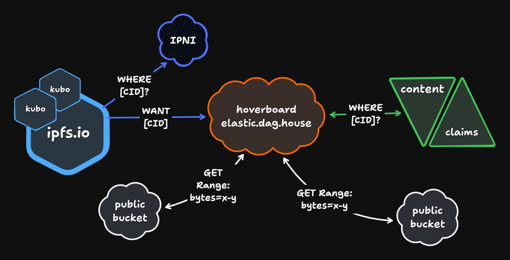

# hoverboard 🛹

An [IPFS Bitswap] Peer Cloudflare Worker



## Usage

You can connect to hoverboard from any compatible libp2p node that supports the (secure) websocket transport.

### Peer Address

The libp2p multiaddr of the production hoverboard deployment run by the Storacha Network is:

```
/dns4/elastic.dag.house/tcp/443/wss/p2p/bafzbeibhqavlasjc7dvbiopygwncnrtvjd2xmryk5laib7zyjor6kf3avm
```

## Getting started

Install `node` >= 18, and `wrangler` >= 3

Copy `.example.dev.vars` to `.dev.vars` and set the required environment variables.

Run `npm install` to install package dependencies.

Run `npm start` to start a local dev server

```sh
$ npm start
⎔ Starting local server...
[mf:inf] Ready on http://127.0.0.1:8787/
```

`curl` the worker url to get your multiaddr

```sh
$ curl http://127.0.0.1:8787/
⁂ hoverboard v0.0.0 /ip4/127.0.0.1/tcp/8787/ws/p2p/12D3KooWJA2ETdy5wYTbCHVqKdgrqtmuNEwjMVMwEtMrNugrsGkZ
```

Run `example/dial.js` to make a test connection to your local dev server

```sh
$ node example/dial.js /ip4/127.0.0.1/tcp/8787/ws/p2p/12D3KooWJA2ETdy5wYTbCHVqKdgrqtmuNEwjMVMwEtMrNugrsGkZ
Connected to hoverboard 🛹 /ip4/127.0.0.1/tcp/8787/ws/p2p/12D3KooWJA2ETdy5wYTbCHVqKdgrqtmuNEwjMVMwEtMrNugrsGkZ
```

Run `example/bitswap.js` to bitswap some blocks from staging, or pass your local multiaddr to try against dev.

```sh
$ node example/bitswap.js
Connecting to /dns4/hoverboard-staging.dag.haus/tcp/443/wss/p2p/Qmc5vg9zuLYvDR1wtYHCaxjBHenfCNautRwCjG3n5v5fbs
Fetching bafybeicm3skx7ps2bwkh56l3mirh3hu4hmkfttfwjkmk4cr25sxtf2jmby
```

## Secrets

Set the following with `wrangler secret put <key>`

- `PEER_ID_JSON` - stringified json peerId spec for this node

[IPFS Bitswap]: https://specs.ipfs.tech/bitswap-protocol/
